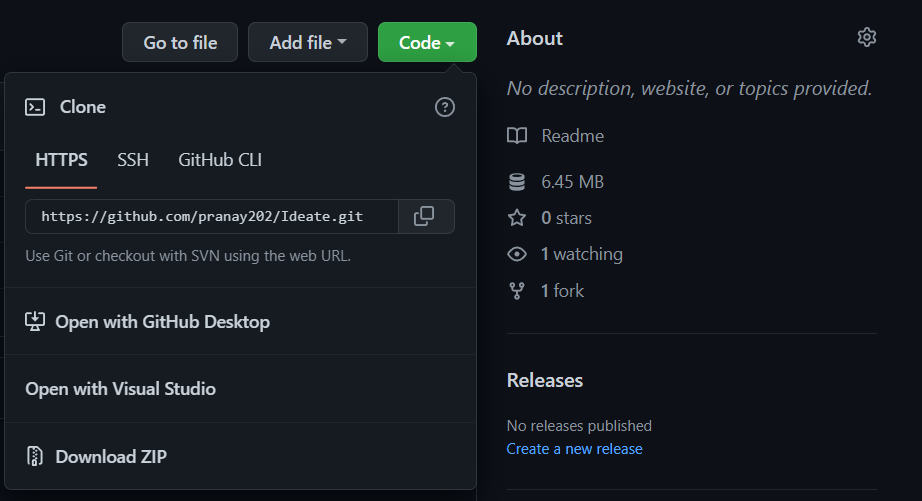

# Ideate - The Project Library for Institutes

<table>
<tr>
<td>
  Ideate provides you one safe place for all the projects created in your Institute!
</td>
</tr>
</table>


# Project Description

## Problem Description

> Students are unaware of project that are already built.
Difficulties in selecting innovative and unique ideas. 
Project idea will get rejected if it is already done.
Again they need to put lots of efforts to find different project ideas.


## Solution
> We brought all project works and details on single platform -
To avoid project ideas from getting repeated, 
To take up unique and innovative project works,
To provide common knowledge platform for peer learning.


<hr>
<br>

## Built with 

- [React JS](https://reactjs.org/)
- [Node JS](https://nodejs.org/) 
- [Express JS](https://expressjs.com/)
- [Mongo DB](https://www.mongodb.com/)
- [Material UI](https://mui.com/)

# Setup

## Prerequisites

<br>

### <a href ="https://www.geeksforgeeks.org/installation-of-node-js-on-windows/" target="_blank"> Nodejs Installed in your system<a/>

### <a href ="https://www.geeksforgeeks.org/ultimate-guide-git-github/?ref=gcse" target="_blank">Knowledge of Git and GitHub<a/>

### <p> <a href ="https://code.visualstudio.com/docs/setup/windows">Install VS CODE </a> or any other IDE </p>

<br>

## Intialization

<br>

### To Contribute give the repo a Star⭐️ and Fork it.


<br>
</img>

### Clone the repo.

</img>
```
git clone https://github.com/Pranay202/Ideate.git
```

<!-- </img> -->


<br>

### Open Terminal on the Folder

```
cd Ideate
```

<br>

### Checkout to the `dev` branch

```
git checkout -b dev
```

<br>

### Go the the `client` directory

```
cd client
```

<br>

### Install the Dependencies

```
npm install
```
### Update the Dependencies
```
npm update
```
### Go to the server folder & do the same (install and update)
```
cd ../server
```

<br>
